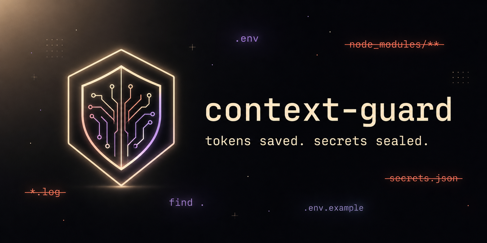

<p align="center">
  
</p>

<h1 align="center">🛡️ context-guard</h1>

<p align="center">
  <b>Stop Claude Code from burning tokens on lockfiles, build output, and logs — and from reading your secrets.</b>
</p>

<p align="center">
  <a href="https://github.com/canellik/claude-context-guard/blob/main/LICENSE"></a>
  
  
  
  
</p>

---

## Why?

A typical Claude Code session in a Node monorepo can dump **hundreds of thousands of tokens** of useless context — `package-lock.json`, source maps, build artifacts, log tails — before Claude even starts on your task. Worse, a stray `Read .env` can leak secrets straight into the model.

`context-guard` adds three `PreToolUse` hooks that fire **before** Claude touches anything:

| Layer            | What it does                                                                                                          |
| ---------------- | --------------------------------------------------------------------------------------------------------------------- |
| 🪨 Bloat shield  | Blocks reads of `node_modules/`, lockfiles, `dist/`, `build/`, `*.log`, `*.map`, `**/generated/**`, …                 |
| 🔒 Secret shield | Blocks `.env*`, `*.pem`, `*.key`, `id_rsa`, `credentials.json`, `service-account*.json`, `.aws/credentials`, …        |
| 🧨 Bash guard    | Catches `find .`, `ls -R`, `grep -R`, `tree`, `git log` (unbounded), `cat *.log` — and **suggests a narrower rewrite** |

Plus `/context-guard:audit` — a slash command that scans your repo and recommends a tailored `.contextguardignore`.

> Zero dependencies. Zero telemetry. Zero network calls. Pure Node.js stdlib.

---

## Install

From the Claude Code marketplace:

```
/plugin marketplace add canellik/claude-context-guard
/plugin install context-guard
```

That's it. The next time Claude tries to read `package-lock.json` or run `find .`, the guard kicks in.

---

## See it in action

Claude tries to read your secrets:

```
Tool: Read  →  .env

✘ context-guard: blocked access to potential secret file (matched "**/.env").
  Path: .env
  If this is intentional, add the path to .contextguardignore.
```

Claude tries to grep the world:

```
Tool: Bash  →  grep -R TODO .

✘ context-guard: this command may flood the context window.
  • [grep-recursive-broad] Recursive grep without --include scans binaries, lockfiles and build artifacts.
    → suggest: grep -R --include='*.ts' --include='*.tsx' <pattern> src/

  Set "bashGuard": "warn" in .contextguardrc.json to make this advisory only.
```

Claude tries to read a 1.4 MB lockfile:

```
Tool: Read  →  package-lock.json

✘ context-guard: blocked read of bloat file (matched "package-lock.json").
  Path: package-lock.json
  Reading large generated/lock/build artifacts wastes context.
```

Because the message lands in Claude's context, it **adapts** — it'll try `npm ls --depth=0` or read `package.json` instead of giving up.

---

## How much does it save?

Real ballpark per session in a typical Node project:

| Scenario                                        | Tokens leaked without guard | With context-guard |
| ----------------------------------------------- | --------------------------- | ------------------ |
| Claude reads `package-lock.json` once           | ~80,000–400,000             | 0                  |
| Claude runs `find .` on a 5k-file repo          | ~25,000                     | 0 (rewritten)      |
| Claude greps the repo for a TODO without filter | ~40,000                     | 0 (rewritten)      |
| Stray `.env` read                               | secret in context           | blocked            |

Numbers vary, but one accidental lockfile read can wipe out a whole session's effective context window. The guard pays for itself the first time it fires.

---

## What gets blocked

### Bloat (default deny — readable via override)

`node_modules/**`, `dist/**`, `build/**`, `.next/**`, `coverage/**`, `vendor/**`, `target/**`, `__pycache__/**`, `package-lock.json`, `yarn.lock`, `pnpm-lock.yaml`, `Cargo.lock`, `composer.lock`, `Gemfile.lock`, `poetry.lock`, `*.lock`, `*.log`, `*.min.js`, `*.min.css`, `*.map`, `**/generated/**`, `*.tsbuildinfo`, …

### Secrets (default deny — high-severity)

`.env`, `.env.*`, `*.pem`, `*.key`, `*.pfx`, `*.p12`, `id_rsa`, `id_ed25519`, `credentials.json`, `secrets.*`, `service-account*.json`, `.aws/credentials`, `.npmrc`, `.netrc`, …

### Broad bash commands (default deny + suggestion)

| Detected                           | Suggested rewrite                                  |
| ---------------------------------- | -------------------------------------------------- |
| `find .` (no `-maxdepth`)          | `find . -maxdepth 2 -type f -name "*.ts"`          |
| `ls -R`                            | `find . -maxdepth 2 -type d`                       |
| `grep -R` (no `--include`)         | `grep -R --include='*.ts' <pattern> src/`          |
| `tree` (no `-L`)                   | `tree -L 2`                                        |
| `cat *.log` / `cat lockfile`       | `tail -n 200 file.log`                             |
| `git log` (unbounded)              | `git log --oneline -n 30`                          |
| `npm ls`                           | `npm ls --depth=0`                                 |
| `du` (no `--max-depth`)            | `du -ah --max-depth=2 . \| sort -rh \| head -30`   |
| `find /`                           | `find . -maxdepth 3`                               |

### File size cap

Any single file over **500 KB** is blocked with a hint to use `head` / `tail` / `sed -n` / `grep`. Tunable.

---

## Configuration

Both files live at the **project root** and are optional.

### `.contextguardignore`

Gitignore-style allow-list. Anything listed here **bypasses** the deny rules.

```gitignore
# Let Claude read this one lockfile
package-lock.json

# Allow a specific generated file
src/generated/types.ts

# Bash overrides — prefix with bash:
bash:find . -maxdepth 6
```

### `.contextguardrc.json`

```json
{
  "maxFileSize": 512000,
  "bashGuard": "block",
  "disableReadGuard": false,
  "disableBashGuard": false,
  "extraDeny": ["data/**", "**/*.sqlite"],
  "extraSecrets": ["**/private-config.json"]
}
```

| Field              | Type                  | Default   | Notes                                                            |
| ------------------ | --------------------- | --------- | ---------------------------------------------------------------- |
| `maxFileSize`      | number (bytes)        | `512000`  | Max bytes for any single file read.                              |
| `bashGuard`        | `"block" \| "warn"`   | `"block"` | `"warn"` lets the command run but injects an advisory.           |
| `disableReadGuard` | boolean               | `false`   | Turn off all file-read protection.                               |
| `disableBashGuard` | boolean               | `false`   | Turn off bash protection.                                        |
| `extraDeny`        | string[] (glob)       | `[]`      | Extra bloat patterns.                                            |
| `extraSecrets`     | string[] (glob)       | `[]`      | Extra secret patterns (treated as HIGH severity).                |

---

## `/context-guard:audit`

Run this in any project:

```
/context-guard:audit
```

You'll get a markdown report:

```
### High-risk files
- src/generated/api-client.ts — 1.2 MB — generated
- logs/app.log — 4.2 MB — log
- package-lock.json — 1.4 MB — lockfile

### Detected secrets
- .env.local — HIGH

### Recommended .contextguardignore additions
src/generated/**
logs/**
```

Then it offers to write the `.contextguardignore` for you.

---

## How it works

Two `PreToolUse` hooks defined in [`.claude-plugin/plugin.json`](.claude-plugin/plugin.json):

- **Read guard** — matches `Read|Edit|Write|NotebookEdit|Glob|Grep`, inspects `tool_input.file_path`, denies based on pattern + size.
- **Bash guard** — matches `Bash`, runs regex rules from [`lib/bash-rewriter.js`](lib/bash-rewriter.js), denies (or warns) with a rewrite suggestion.

Both hooks emit Claude Code's standard `hookSpecificOutput.permissionDecision` JSON shape, which surfaces the reason directly to Claude so it can adapt instead of giving up.

---

## Development

```bash
git clone https://github.com/canellik/claude-context-guard
cd claude-context-guard

# Test a hook locally:
echo '{"tool_name":"Read","tool_input":{"file_path":"package-lock.json"},"cwd":"'"$PWD"'"}' \
  | node hooks/pretool-read-guard.js

echo '{"tool_name":"Bash","tool_input":{"command":"find ."},"cwd":"'"$PWD"'"}' \
  | node hooks/pretool-bash-guard.js
```

Install the plugin from a local path during development:

```
/plugin marketplace add /absolute/path/to/claude-context-guard
/plugin install context-guard
```

---

## License

MIT — see [LICENSE](LICENSE).

Issues and PRs welcome at <https://github.com/canellik/claude-context-guard>.
